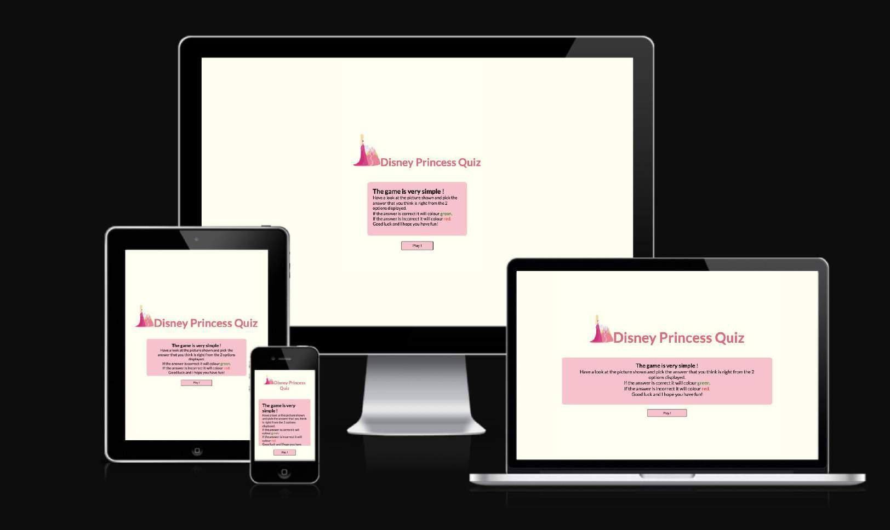
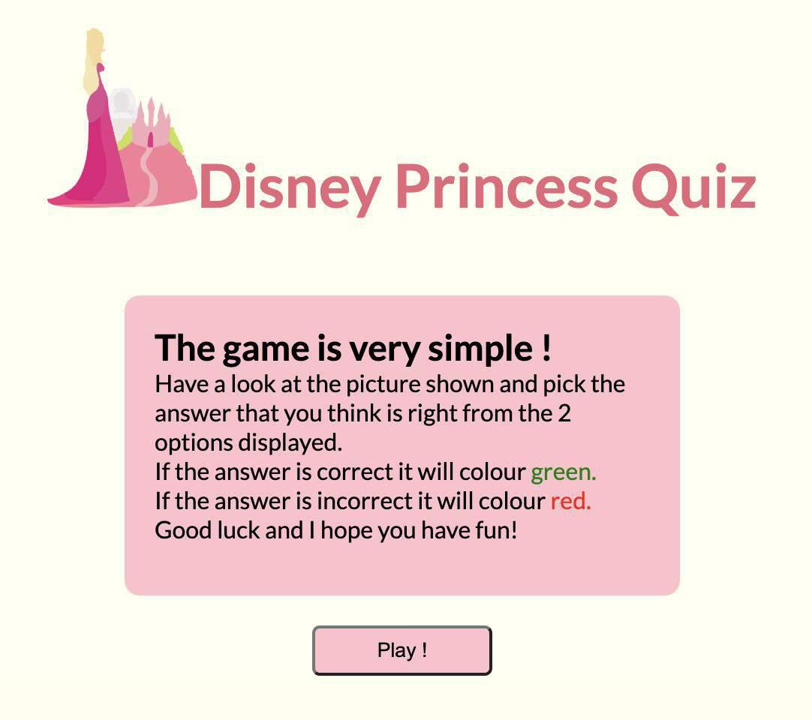
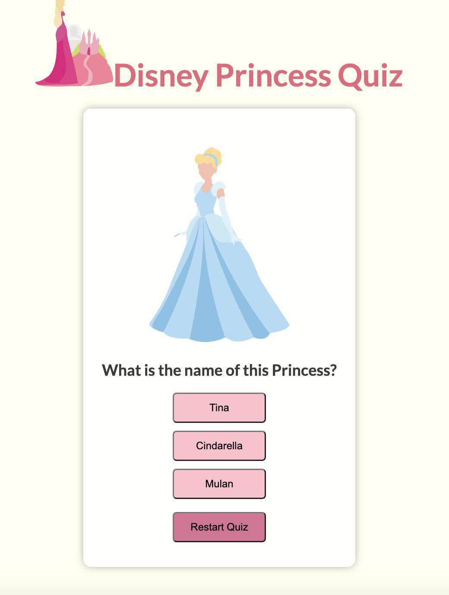
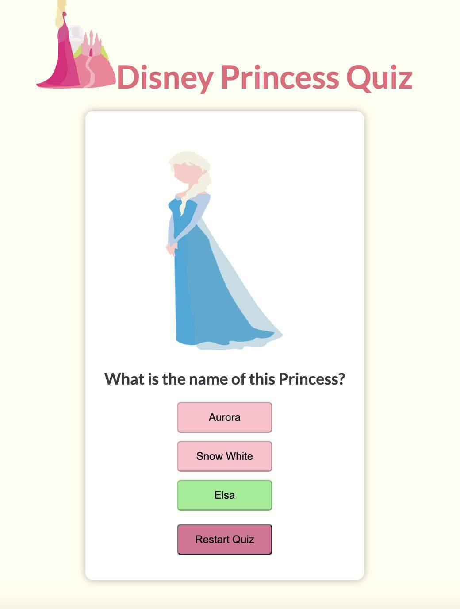
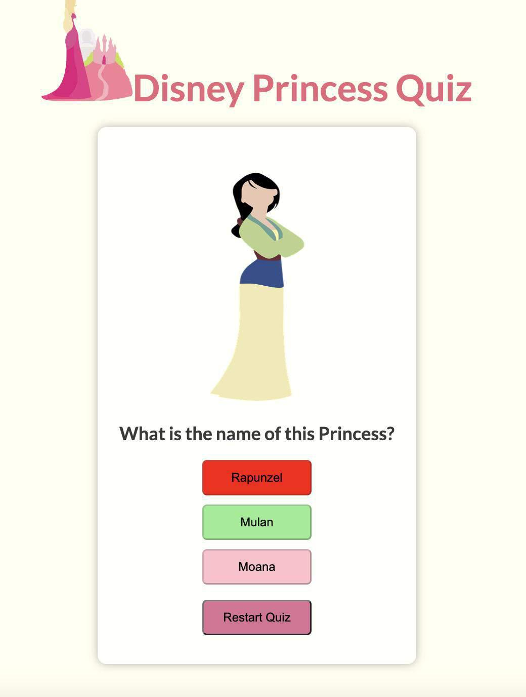
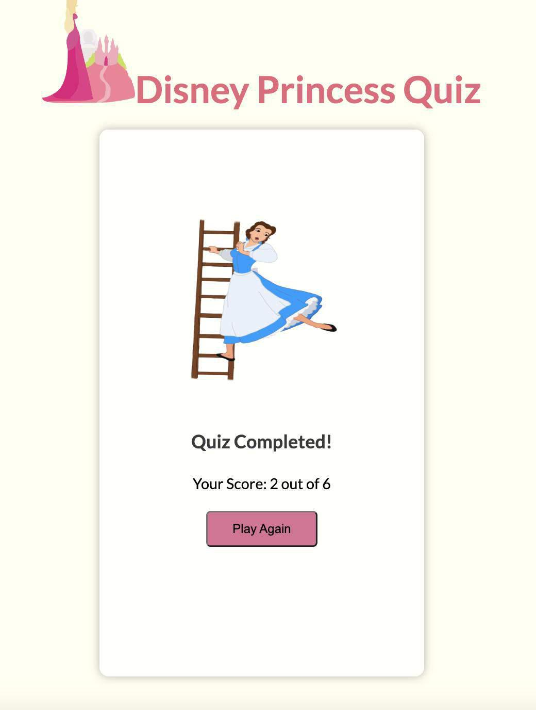
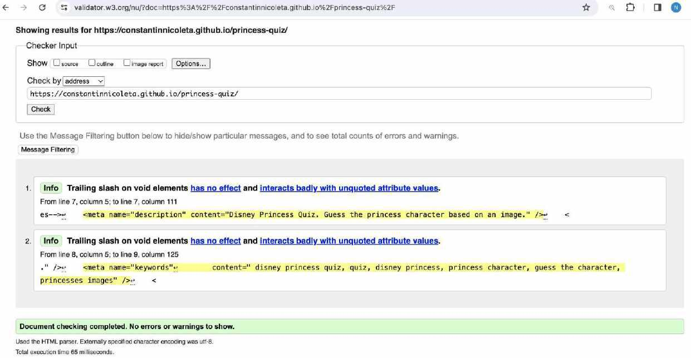
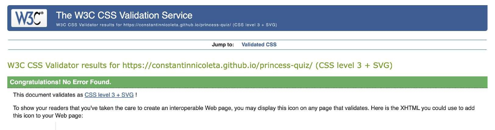
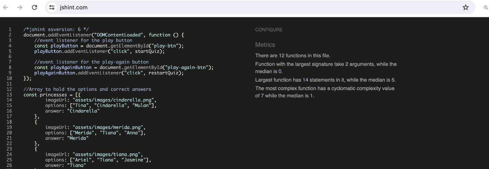
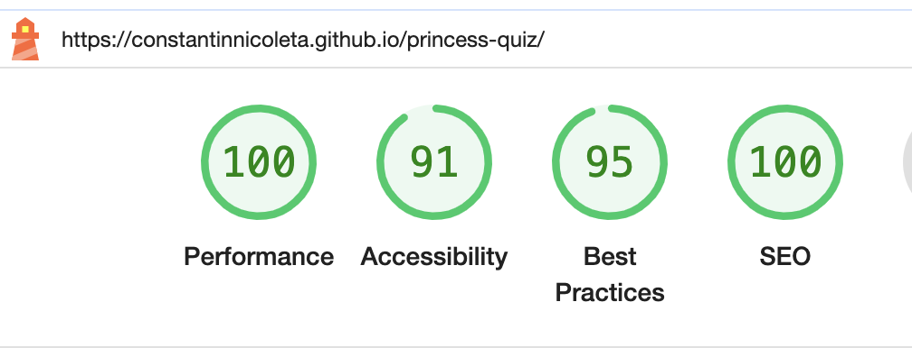

  # Disney Princess Quiz
   This quiz will put your Disney knowledge to the test like never before with our exciting Disney Characters. Are you ready to embark on an adventure through the iconic worlds of Disney animation and meet some familiar faces along the way?

In this quiz, we'll be showing you images of beloved Disney princess characters and is your job to is to identify each princess  correctly from the options provided. 

Live link can be found here - [Click here](https://constantinnicoleta.github.io/princess-quiz/)

# Planning Overview

## Site goals
- Aim for fast loading times and smooth functionality to provide users with a seamless experience.
- Straightforward understanding of the quiz rules displayed.
- Create a dynamic experience that captivates users and encourages them to spend time on the site.
- Provide users with entertainment as they explore the world of Disney through this quiz.

## Target Audience
Our Disney quiz is perfect for anyone who loves Disney! Whether you're a kid, a parent, or a lifelong Disney enthusiast, this quiz is for you.
- Disney lovers of all ages.
- Those who enjoy testing their Princess Disney knowledge.
- Anyone who wants a fun and nostalgic trip through Disney's magical world.

## User-stories

### First-time user 
- As a first time user I expect vibrant colors, clear Disney imagery, and an catchy message that sets the stage for a fun and entertaining experience.
- As a first-time user I want to quickly understand how the quiz works through clear and concise instructions.
- As a first-time user I expect the quiz interface to be user-friendly, with intuitive navigation and appealing design elements.

### Returning user
- As a returning user I expect to have the same seamlesss experience while playing the quiz.
- As a returning user I expect to be familiar with the quiz and design of it.

## Design

I have used the following colours as the quiz was pink themed:
 - rgba(255, 255, 255, 0.8);
 - rgb(243, 117, 136);
 - rgb(231, 101, 123); 
 - palevioletred;
 - black;
 - pink;
 -ivory;

 ## Fonts 

I've opted for the Lato font for the quiz, carefully selecting various font-weights to seamlessly complement the imagery.

# Existing Features 
 ## Landing page
 
 - The landing page features a descriptive text box aimed at guiding users through the rules of the quiz.
 - It also has the name displayed at the top of the page "Disney Princess Quiz" and a picture as logo.
 Here, users are introduced on how it works, including what occurs upon correctly guessing an answer and the outcome if they happen to guess incorrectly.
 - Lastly, it also features a "Play!" button prompting the user to begin engaging with the content.
 

 ## Quiz area
 - The quiz area has been created in a container styled to catch attention.
 -  The quiz is a key feature as it presents to the users with the same question" What is the name of this Princess?", images of Disney princesses and three answer options.
 -  A restart button is also displayed which allows the users to restart the quiz in a random order at any point which also restarts the score.
 

 ### Checking answers
 After the user starts the quiz and click a button for their selected option, the users receive immediate feedback on their 
   choices:
   1. Correct answers coloured green
   
   2. Incorrect answers couloured red as well as displaying which was the correct answer
   

 ## End of quiz & Score
 - Once the user finishes the quiz, "Quiz completed!" text will display as well as the final score reflecting the number of correct answers achieved throughout the quiz.
 - The user is also given the option to play again by clicking on the displayed button " Play again!" which can encourage the users to take the quiz one more time. 
 - The order of the pictures is randomly selected therefore the user should expect a fun experience trying to guess which one could be next.

 

 # Testing 

 ### Manual testing
 I have manually tested each element's appearance and responsiveness:

| Action | Expected behaviour | Pass/Fail |
--- | --- | --- |
| click Play  | quiz starts | Pass
| click Option button | colour green if correct| Pass 
| click Option button | colour red if incorrect | Pass
| click Restart Quiz| quiz starts from the beggining in a random order| Pass
| answer last question | displays score | Pass
| click Play again | quiz starts again in a random order | Pass

## Browser testing
I have played the quiz in different browsers such as Safari, Google Chrome and Microsoft Edge and no issues displayed.

## Device testing
The quiz has been displayed on multiple devices: MacBook Pro, Iphone 14 Pro Max, 15 Pro Max, 11 Pro Max and Huawei tablet, to ensure responsiveness on various screen sizes. No issues found.

## Validator Testing
- HTML
No errors were found when passing through the official HTML validator as below:
 

-CSS
No errors were found when passing through the official CSS validator:

-JAVASCRIPT
No errors were found when passing through the official Jshint validator:

## Lighthouse Score

The quiz has received the below Lighthouse score :

## Unfixed bugs
No bugs were found.

# Deployment

The project was deployed using GitHub Pages. I have followed these below steps for deployment:

1. Go to the repository on GitHub.com

2. Select 'Settings' near the top of the page.

3. Choose 'Pages' from the menu bar on the left.

4. Under 'Source', select the 'Branch' dropdown and choose the main branch.

5. Click 'Save'.

6. Page will be automatically refresh and after a few minutes a green dot will appear to indicate the successful deployment.

Live link can be found- [here](https://constantinnicoleta.github.io/princess-quiz/)

# Credits
## Content & Technologies
1. The text for the quiz was created by me.
2. The picture used for the Favicon was taken from [Pixabay](https://pixabay.com/) and later generated in [Favicon](https://www.favicon-generator.org/)
3. The photos used throughout the entire project are from [Pixabay](https://pixabay.com/)
4. Google Font was taken from [Google](https://fonts.google.com/)
5. I've used a File compression tool in order to reduce the size of my pictures - [Small Pdf](https://smallpdf.com/)
6. I've used a converter to convert my jpg images to webP - [WebP Converter](https://webpconverter.com/)
7. I have checked if my website is responsive on [Am I Responsive](https://ui.dev/amiresponsive)

## Resources used
1. Inspiration for code-structure from Code Institute's Love Math project.
2. README structure - Inspired by CI read-me template
3. W3schools - syntaxes reminder
4. How to implement a shuffled array - [Javascript shuffled array tutorial](https://p14.medium.com/shuffle-an-array-javascript-cbc6fa8662a0)
5. How to use Timeout in a function - [TimeOut functionality tutorial](https://www.freecodecamp.org/news/javascript-settimeout-js-timer-to-delay-n-seconds/)

## Mentions
- I would like to mention my mentor Dick Vlaanderen who has been great throughout this project pointing me in the right direction and always making good suggestions on what to improve in my projects.

